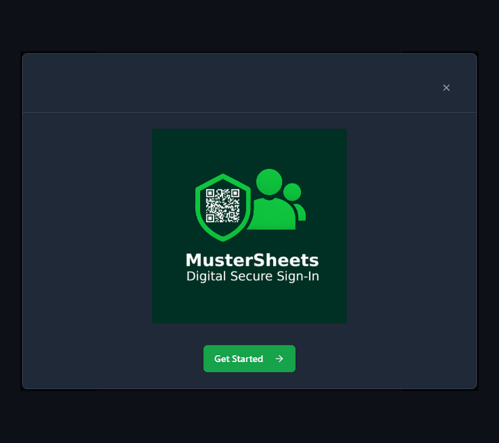
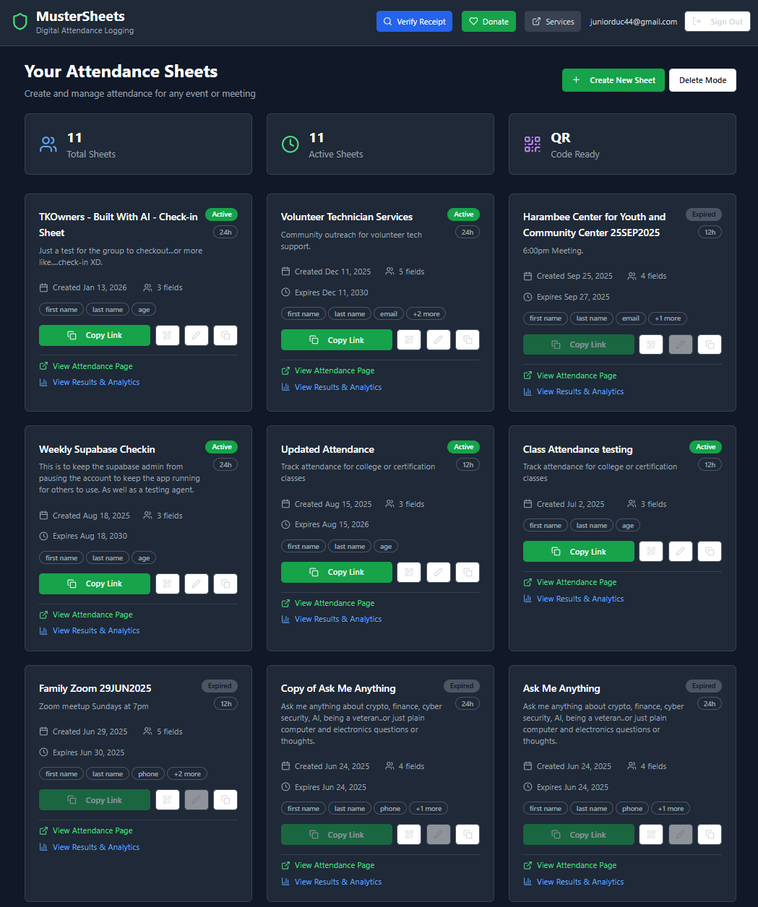
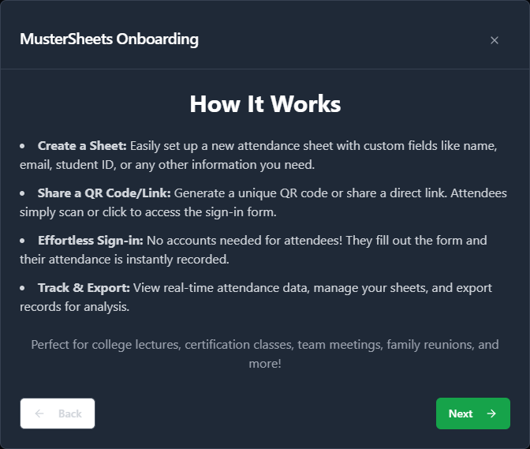
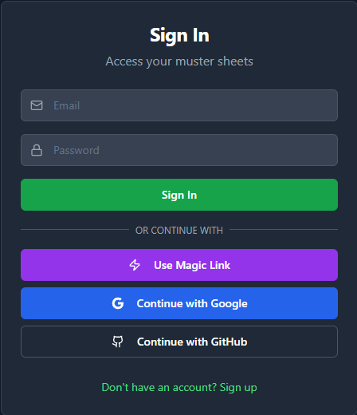

# Muster Buddy Check

> **App name:** MusterSheets · **Repo:** muster-buddy-check · **Version:** 4.0.0

A lightweight, QR-based attendance app for events, formations, classes, and clubs. Organizers create a muster sheet; attendees scan a QR code or open a link and sign in — **no account required**. Each sign-in produces a tamper-evident receipt, and organizers see check-ins in real time.

**Live:** [mustersheets.netlify.app](https://mustersheets.netlify.app) · [juniorduc44.github.io/muster-buddy-check](https://juniorduc44.github.io/muster-buddy-check)

<p align="center">
  
  <br>
  <em>From onboarding to QR check-in in a few taps.</em>
</p>

## About this project

Muster Buddy Check is **inspired by my time conducting musters in the U.S. Navy** — the everyday problem of accounting for people quickly and accurately, without paper. It's a personal project built to be genuinely useful for small events and a working demonstration of a modern, secure web stack.

It was built with **AI-accelerated development** — I directed the architecture and security decisions (Row Level Security model, environment-variable separation, Supabase auth, the proof-of-attendance receipt design) and used AI tooling to move fast on implementation.

> Note on scope: this is a free-tier hosted web app, not an accredited or DoD-authorized system. It's designed for everyday attendance tracking, not for environments that require formal security accreditation.

## Features

- **QR / link attendance** — share a QR code or `/attend/:sheetId` link; attendees sign in with no account.
- **Configurable sign-in fields** — name (required), plus optional email, phone, rank, badge number, unit, age, per sheet.
- **Proof-of-attendance receipt** — each entry gets a SHA-256 receipt (hash + QR) the attendee can save.
- **Real-time results** — organizers view check-ins live and export to CSV.
- **Creator-only verification** — only the sheet owner can verify receipts and view attendee details, enforced by Supabase Row Level Security.
- **Flexible auth** — email/password, magic link, GitHub OAuth, plus a guest mode for quick one-off sheets.
- **12- or 24-hour ("military") time** formatting per sheet.

## Screenshots

<table>
  <tr>
    <td width="50%" align="center">
      <br>
      <sub><b>Organizer dashboard</b> — all your sheets, live counts, and quick actions.</sub>
    </td>
    <td width="50%" align="center">
      <br>
      <sub><b>How it works</b> — create, share a QR, sign in, track &amp; export.</sub>
    </td>
  </tr>
  <tr>
    <td width="50%" align="center">
      <br>
      <sub><b>Flexible sign-in</b> — password, magic link, Google, or GitHub.</sub>
    </td>
    <td width="50%" align="center">
      <br>
      <sub><b>Guided onboarding</b> — a friendly intro for first-time organizers.</sub>
    </td>
  </tr>
</table>

## Routes

| Route | Access | Purpose |
|-------|--------|---------|
| `/` | Public | Landing, dashboard, sheet creation |
| `/attend/:sheetId` | **Public** | Attendee sign-in form |
| `/qr/:sheetId` | Creator | QR code to share/print |
| `/results/:sheetId` | Creator (owner only) | Live results, CSV export, receipt verification |
| `/edit/:sheetId` | Creator (owner only) | Edit a sheet |

## Tech stack

Vite · React 18 + TypeScript · React Router · TanStack Query · Tailwind CSS + shadcn-ui (Radix) · Supabase (Postgres + Row Level Security + Edge Functions) · `qrcode`.

## Getting started

**Prerequisites:** Node.js 18+, npm, and a Supabase project (free tier is fine).

```bash
git clone https://github.com/Juniorduc44/muster-buddy-check.git
cd muster-buddy-check
npm install
cp .env.example .env      # then fill in your Supabase keys
npm run dev               # dev server at http://localhost:8080
```

### Supabase setup

1. Create a Supabase project.
2. In **SQL Editor**, run the migrations in `supabase/migrations/` in date order.
3. Apply Row Level Security policies — `npm run apply-rls` (uses your service-role key) **or** run the SQL manually.
4. Copy your project URL and keys into `.env` (see below).

### Environment variables

| Variable | Used by | Notes |
|----------|---------|-------|
| `SUPABASE_URL` | CLI scripts | Project URL |
| `SUPABASE_SERVICE_KEY` | CLI scripts only | **Secret** — never exposed to the browser |
| `VITE_SUPABASE_ANON_KEY` | Browser | Public anon key (safe to ship) |

Only `VITE_`-prefixed variables are exposed to the client by Vite.

### Testing the QR flow on a phone (LAN)

```bash
npm run dev -- --host          # expose the dev server on your network
```

Open `http://<your-computer-ip>:8080` on a phone on the same Wi-Fi. Note: the device **camera** requires a secure context (HTTPS or `localhost`), so live camera features work on the deployed HTTPS site and on `localhost`, but not over a plain `http://<ip>` LAN address — there, file upload still works.

## Scripts

| Script | Does |
|--------|------|
| `npm run dev` | Start Vite dev server (port 8080) |
| `npm run build` | Production build to `dist/` |
| `npm run preview` | Serve the production build locally |
| `npm run lint` | Run ESLint |
| `npm run apply-rls` | Install Supabase RLS policies |
| `npm run deploy` | Publish `dist/` to GitHub Pages (`gh-pages`) |

## Deployment

- **GitHub Pages** (primary): pushing to `main` triggers `.github/workflows/main.yml`, which builds and deploys `dist/`.
- **Netlify**: connect the repo, build command `npm run build`, publish directory `dist/`; `public/_redirects` provides SPA routing.

Either way, set `VITE_SUPABASE_ANON_KEY` (and any `VITE_` vars) in the host's environment, and ensure the RLS policies have been applied to your Supabase project.

## Changelog

See [`CHANGELOG.md`](./CHANGELOG.md) and the `RELEASE_*.md` notes for version history.

## License

Personal project by [@jrducs](https://github.com/Juniorduc44). Not affiliated with or endorsed by the U.S. Navy or Department of Defense.
